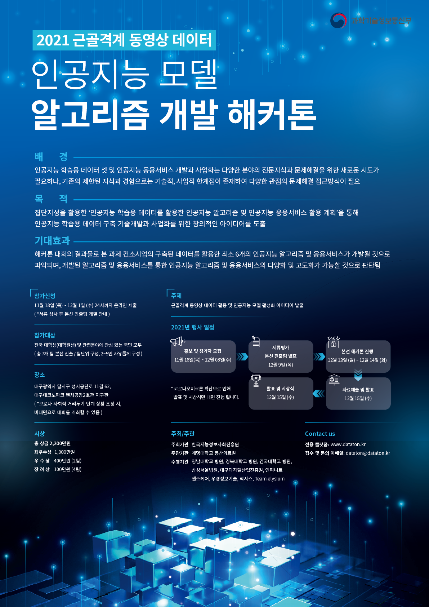
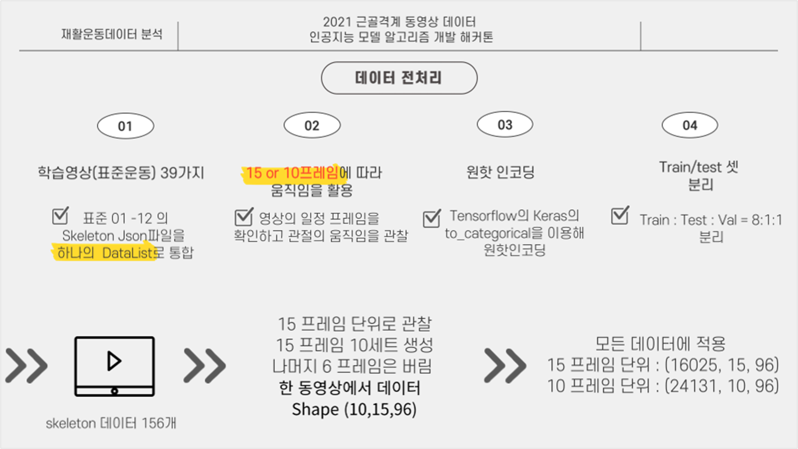
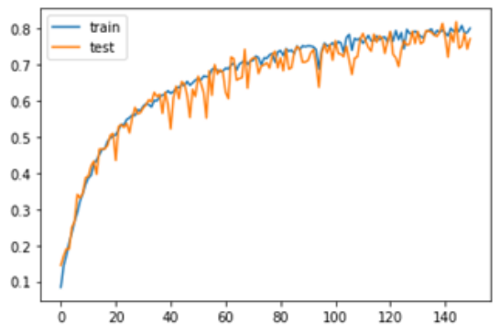
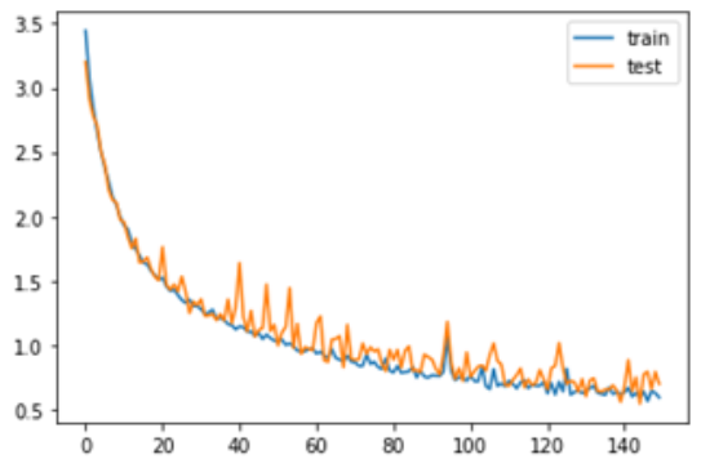

# 2021년 근골격계 동영상 데이터 인공지능 모델 알고리즘 개발 해커톤 대회

## 실행 예시
<details>
<summary>Preprocessing</summary>
<div markdown="1">

```
$ python preprocess.py
```
#### Args
1. -d, --dataset
   - 데이터셋 디렉토리
   - 기본 값: "dataset/학습영상(표준운동)39가지/"
2. -f, --frame_rate
   - n 프레임 당 한 이미지 저장 (낮을수록 학습량 증가)
   - 기본 값: 6
3. -l, --lstm
   - LSTM 구간 범위 (낮을수록 학습량 증가)
   - 기본 값: 15
4. -i, --img_size
   - 이미지 Resize 크기 (높을수록 학습량 n^2배 증가)
   - 기본 값: 112
</div>
</details>


<details>
<summary>Train</summary>
<div markdown="1">

```
$ python train.py
```
</div>
</details>


<details>
<summary>Predict</summary>
<div markdown="1">

```
$ python predict.py 
```
</div>
</details>

<br>

## 대회 정보


### 대회 설명
39개 재활운동 동영상 중 25가지 동작에 대한 신체 키 포인트 위치를 제공하며, 이를 통해 해당 임상정보(json)가 어떤 동작에 해당하는지 제출

## 제안 방법



## Result
<table>
<th>Accuracy</th>
<th>Loss</th>
<tr>
<td></td>
<td></td>
</tr>
</table>